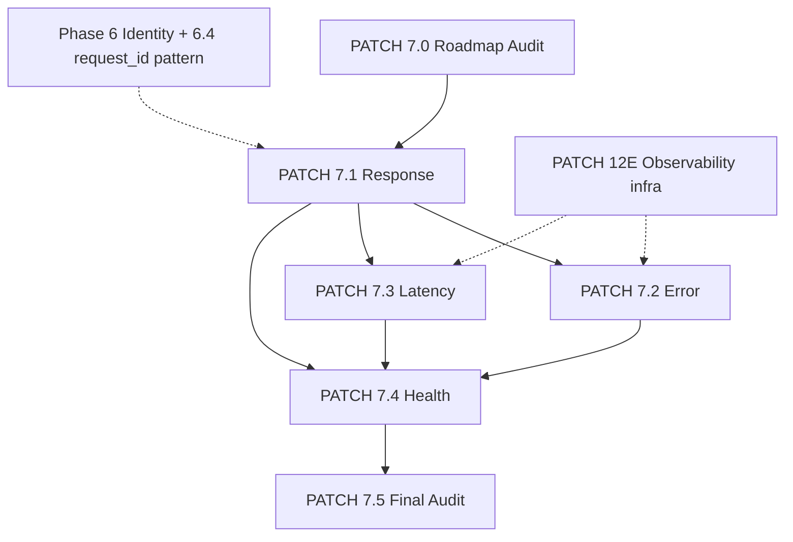

# PATCH 7.0 — Auditoria da Fase 7 e Validação do Roadmap

**Data da auditoria:** 2026-07-22  
**Tipo:** Auditoria read-only — **nenhuma implementação**  
**Roadmap:** [02_analytics_roadmap.md](./02_analytics_roadmap.md) — FASE 7  
**Predecessora encerrada:** [PHASE_6_MASTER_CLOSURE.md](./PHASE_6_MASTER_CLOSURE.md)  
**Governança:** [01_analytics_foundation.md](./01_analytics_foundation.md) · [DASHBOARDS.md](./DASHBOARDS.md)

---

## 1. Objetivo

Responder:

> *"A Fase 7 está corretamente planejada antes da implementação?"*

Validar escopo, arquitetura, ordem dos patches, dependências, sobreposição com fases anteriores, riscos, critérios de aprovação e governança — **sem** criar código, SQL, dashboards, eventos ou instrumentação.

---

## 2. Roadmap validado

| Patch | Responsabilidade | Status planejamento |
|-------|------------------|---------------------|
| **7.0** | Auditoria inicial + validação roadmap | ✅ Este relatório |
| **7.1** | Response Analytics — outcomes de resposta da plataforma | 🟡 Escopo OK · métricas a detalhar na implementação |
| **7.2** | Error Analytics — falhas, reason codes, degradações | 🟡 Escopo OK · depende decisão de persistência |
| **7.3** | Latency Analytics — duração, percentis, por endpoint | 🟡 Escopo OK · gap de dados identificado |
| **7.4** | Health Metrics — disponibilidade, readiness, saúde agregada | 🟡 Escopo OK · base parcial existente (`/api/health`) |
| **7.5** | Auditoria Final da Fase 7 | ✅ Padrão estabelecido (Fases 5 e 6) |

**Atualização aplicada:** `02_analytics_roadmap.md` passa a incluir PATCH 7.0 (alinhamos ao padrão Fases 5 e 6).

---

## 3. Escopo por patch (Etapa 1)

### PATCH 7.1 — Response Analytics

| Dimensão | Definição |
|----------|-----------|
| **Objetivo** | Medir **outcomes de resposta** da plataforma MIA: taxa de conclusão, status HTTP, `response_path` runtime, rotas degradadas vs completas |
| **Responsabilidade** | Classificar respostas **técnicas** (não qualidade semântica da recomendação) |
| **Limites** | Não mede conversão (Fase 4/5), não mede efetividade DL (Fase 6.4), não altera Response Builder |
| **Entregáveis previstos** | `RELIABILITY_RESPONSE_ANALYTICS.md` · `analytics-reliability-response.sql` · 4 splits · testes · prod validation |
| **Dependências** | Identity Layer (session/visitor/conversation) · padrão observacional Fase 6 |

### PATCH 7.2 — Error Analytics

| Dimensão | Definição |
|----------|-----------|
| **Objetivo** | Medir **falhas** observáveis: `reason_code`, provider errors, timeouts, indisponibilidade comercial, 4xx/5xx |
| **Responsabilidade** | Taxonomia de erro + agregação — **não** corrige erros |
| **Limites** | Não duplica integridade de campos Analytics (4.5); não confunde com `price_drop_email_*_failed` (domínio e-mail) |
| **Entregáveis previstos** | `RELIABILITY_ERROR_ANALYTICS.md` · SQL + splits + testes |
| **Dependências** | **7.1** (outcome envelope) · infra PATCH 12E (`miaObservability`, `reasonCode`) |

### PATCH 7.3 — Latency Analytics

| Dimensão | Definição |
|----------|-----------|
| **Objetivo** | Medir **latência** end-to-end: duração por endpoint, percentis, outliers |
| **Responsabilidade** | Tempo de resposta técnico — não latência percebida conversacional |
| **Limites** | `query_duration_ms` (6.4) = subset pipeline comercial DL apenas |
| **Entregáveis previstos** | `RELIABILITY_LATENCY_ANALYTICS.md` · SQL + splits + testes |
| **Dependências** | **7.1** (correlação `request_id`) · **decisão de persistência** (ver §8) |

### PATCH 7.4 — Health Metrics Analytics

| Dimensão | Definição |
|----------|-----------|
| **Objetivo** | Medir **disponibilidade e saúde**: `/api/health`, `/api/ready`, taxas agregadas de erro/latência |
| **Responsabilidade** | Métricas de saúde operacional — não health estratégico de growth (5.1) |
| **Limites** | Não substitui monitoramento externo Vercel; complementa Analytics interno |
| **Entregáveis previstos** | `RELIABILITY_HEALTH_ANALYTICS.md` · SQL + splits + testes |
| **Dependências** | **7.1–7.3** para dashboards agregados · endpoints existentes |

### PATCH 7.5 — Auditoria Final

Consolidação, matriz, checklist, `PHASE_7_MASTER_CLOSURE.md` — espelha Fases 5 e 6.

### Sobreposição entre patches 7.x

| Par | Risco | Resolução recomendada |
|-----|-------|------------------------|
| **7.1 ↔ 7.2** | Response inclui falhas | 7.1 = outcome binário/multinível; 7.2 = taxonomia detalhada de falha (subset) |
| **7.2 ↔ 7.3** | Erros lentos vs timeouts | Timeout é classe de erro (7.2) **e** sinal de latência (7.3) — correlacionar via `request_id` |
| **7.3 ↔ 7.4** | Latência alta ≠ unhealthy | Health = agregação + synthetic probes; latência = distribuição contínua |

**Nenhuma duplicação bloqueante** — fronteiras documentadas acima.

---

## 4. Auditoria das fases anteriores (Etapa 2)

| Fase | Entrega existente | Conflito com Fase 7? | Delta obrigatório |
|------|-------------------|----------------------|-------------------|
| **4.5** Data Quality Dashboard | Cobertura de campos em `analytics_events` | ❌ Não | 4.5 = instrumentação; 7.x = confiabilidade runtime |
| **5.1** Growth Strategic | `strategic-health-snapshot` (stickiness, novos/recorrentes) | ⚠️ Nomenclatura | 5.1 = saúde **estratégica**; 7.4 = saúde **operacional** |
| **6.4** DL Usage | `data_layer_resolution`, `query_duration_ms`, `response_path` | ⚠️ Parcial | 6.4 = efetividade DL; 7.x = confiabilidade plataforma; reutilizar campos, não redefinir |
| **12E** Observability | `withMiaObservability`, logs JSON stdout, `miaMetrics` in-memory | ⚠️ Fonte de dados | 12E = infra runtime; 7.x = persistência Analytics SQL (decisão §8) |
| **6.1–6.3** | SQL catálogo Supabase | ❌ Não | Domínios distintos |

**Eventos existentes com semântica de erro (não duplicar escopo 7.2):**

- `price_drop_email_e2e_failed` / `price_drop_email_failed` — domínio e-mail
- `metadata.error_code` em eventos e-mail — não erro HTTP MIA chat

**Health hoje:** `GET /api/health` (200 liveness) e `GET /api/ready` (503 se config ausente) — usados em prod-validation scripts, **não persistidos** em `analytics_events`.

---

## 5. Auditoria arquitetural (Etapa 3)

| Princípio | Compatível Fase 7? | Condição |
|-----------|-------------------|----------|
| MIA owns the intelligence | ✅ | Analytics mede; não decide recomendação |
| Data Layer / Decision Engine / Router | ✅ | Sem alteração de lógica comercial |
| Contracts / Response Builder | ✅ | Extensão contrato §7.x observacional |
| Analytics observacional | ✅ | Fire-and-forget; falha Analytics não quebra chat |
| Nenhuma inteligência em Analytics | ✅ | Dashboards read-only |
| Nenhuma decisão tomada por Analytics | ✅ | Proibido feedback loop automático |

**Restrição permanente (Fase 6 replicada):** instrumentação 7.x deve ser **non-blocking INSERT** ou SQL read-only — nunca alterar ordem de execução do pipeline comercial.

---

## 6. Métricas previstas (Etapa 4)

**Regra Fase 6 reutilizada:** `valor_absoluto` + `valor_relativo` + `registros_total` + `referencia_denominador`; NULL quando amostra insuficiente.

### 7.1 Response

| Métrica (planejada) | Absoluto | Relativo | Denominador | Fonte |
|---------------------|----------|----------|-------------|-------|
| `request_completion_rate` | requests completados | taxa | requests instrumentados | evento/SQL |
| `http_2xx_rate` | respostas 2xx | taxa | requests totais | evento |
| `degraded_response_rate` | paths degradados | taxa | requests comerciais | `response_path` metadata |
| `no_result_rate` | sem resposta útil | taxa | requests comerciais | classificação outcome |

### 7.2 Error

| Métrica (planejada) | Denominador | Fonte |
|---------------------|-------------|-------|
| `error_rate` | requests instrumentados | `reason_code` / status ≥400 |
| `provider_failure_rate` | provider attempts | metadata provider |
| `commercial_unavailable_rate` | turns comerciais | flag existente 6.4 |
| Distribuição por `reason_code` | erros totais | taxonomia 12E |

### 7.3 Latency

| Métrica (planejada) | Denominador | Fonte |
|---------------------|-------------|-------|
| `p50/p95/p99_duration_ms` | requests por endpoint | duração persistida |
| `slow_request_rate` | > threshold ms | requests totais |
| `avg_duration_ms` | requests | agregado |

**Gap:** `query_duration_ms` (6.4) cobre apenas pipeline comercial — **insuficiente** para 7.3 completo.

### 7.4 Health

| Métrica (planejada) | Denominador | Fonte |
|---------------------|-------------|-------|
| `health_check_success_rate` | probes | synthetic / cron |
| `ready_check_success_rate` | probes | `/api/ready` |
| `platform_availability_proxy` | janela temporal | agregação 7.1–7.3 |
| `error_budget_consumption` | SLO window | derivado |

**Métricas mal definidas hoje:** thresholds de latência (p95 alvo), SLO numérico, lista fechada de endpoints instrumentados — **definir no PATCH 7.1** antes de 7.3/7.4.

---

## 7. Eventos (Etapa 5) — planejamento only

| Pergunta | Resposta |
|----------|----------|
| Reutilizar eventos existentes? | **Parcial** — correlacionar com `mia_question_sent`, `data_layer_resolution` via `request_id` / `session_id` |
| Criar novos? | **Provável** — padrão Fase 6 sugere 1 evento parametrizado server-side (ex.: `platform_reliability_resolution`) ou família versionada `7.x.0` |
| Expandir contratos? | **Sim** — EVENT_CONTRACT §7.6+ (documentar em 7.1, não neste patch) |
| Versionamento? | **Sim** — `metadata.event_version = "7.x.0"` por patch ou versão unificada `"7.0.0"` incrementada |

**Decisão recomendada (pré-7.1):** evento único parametrizado (como `data_layer_resolution`) com flags `outcome`, `reason_code`, `duration_ms`, `endpoint`, `http_status` — evita proliferação.

**Nenhum evento criado no PATCH 7.0** ✅

---

## 8. Dashboards (Etapa 6) — planejamento only

| Patch | SQL principal (previsto) | Queries split | Origem dados | Produção |
|-------|--------------------------|---------------|--------------|----------|
| 7.1 | `analytics-reliability-response.sql` | 4 | `analytics_events` | pós-instrumentação |
| 7.2 | `analytics-reliability-error.sql` | 4 | `analytics_events` | idem |
| 7.3 | `analytics-reliability-latency.sql` | 4 | `analytics_events` | idem |
| 7.4 | `analytics-reliability-health.sql` | 4 | `analytics_events` + probes | idem |

**Frequência:** snapshot diário UTC (padrão Fases 4–6) + painéis de capacidade.

**Decisão crítica pré-implementação:**

```
PATCH 12E (logs stdout + miaMetrics in-memory)
        ↓  [GAP — não persiste em Supabase hoje]
        ↓  decisão obrigatória em 7.1
analytics_events (INSERT observacional server-side)
        ↓
SQL dashboards Fase 7
```

Alternativas documentadas (não escolher automaticamente):

| Opção | Prós | Contras |
|-------|------|---------|
| **A — Persistir via analytics_events** | Alinhado Fase 6; SQL unificado; prod validation existente | Volume de eventos; schema metadata |
| **B — SQL só em logs Vercel** | Zero instrumentação nova | Fora padrão Analytics; sem prod validation Supabase |
| **C — Híbrido** | Flexível | Duplicação; governança complexa |

**Recomendação auditoria:** **Opção A** — consistência arquitetural com Fase 6.

---

## 9. Mapa de dependências (Etapa 7)



| Patch | Depende | Paralelo? | Bloqueadores |
|-------|---------|-----------|--------------|
| 7.0 | Fase 6 encerrada | — | — |
| 7.1 | 7.0 | — | Decisão persistência (Opção A/B/C) |
| 7.2 | 7.1 | após 7.1 | Taxonomia outcome 7.1 |
| 7.3 | 7.1 | com 7.2 após 7.1 | Instrumentação duração |
| 7.4 | 7.1, 7.2, 7.3 | — | Dados agregados |
| 7.5 | 7.1–7.4 | — | — |

---

## 10. Riscos (Etapa 8)

| ID | Risco | Classificação | Justificativa |
|----|-------|---------------|---------------|
| R7-01 | Dashboards sem dados persistidos (logs só stdout) | **Alto** | `miaMetrics` in-memory; cold start zera; SQL Supabase vazio |
| R7-02 | Duplicação semântica com 6.4 `query_duration_ms` | **Médio** | Mesmo campo, escopos diferentes — exige delta doc |
| R7-03 | Confusão health 5.1 vs 7.4 | **Médio** | Aliases similares — prefixo `platform_*` vs `strategic_*` |
| R7-04 | Volume eventos reliability >> custo Supabase | **Médio** | Mitigar: 1 evento/request instrumentado, metadata compacta |
| R7-05 | Instrumentação altera latência percebida | **Baixo** | Padrão 6.4 provou non-blocking |
| R7-06 | Regressão comercial se hooks mal posicionados | **Alto** | Mitigar: hooks após resposta; testes regressão obrigatórios |
| R7-07 | Documentação 7.0 ausente no roadmap mestre | **Baixo** | Corrigido neste patch |
| R7-08 | Critérios SLO não numéricos | **Médio** | Definir em 7.1 antes de 7.4 |

---

## 11. Governança (Etapa 9)

Padrões Fase 6 **aplicáveis** à Fase 7:

| Padrão | Status |
|--------|--------|
| Roadmap oficial atualizado | ✅ (7.0 adicionado) |
| Relatório por patch (`PATCH_7.x_*.md`) | 📋 A criar em 7.1–7.4 |
| SQL principal + 4 splits | 📋 Planejado |
| Docs estratégicos (`RELIABILITY_*.md`) | 📋 Planejado |
| Changelog contínuo | ✅ Iniciado (§ changelog) |
| Versionamento evento | 📋 Planejado |
| Prod validation scripts | 📋 Planejado |
| `PHASE_7_MASTER_CLOSURE.md` | 📋 PATCH 7.5 |
| Checklist final | 📋 PATCH 7.5 |

---

## 12. Matriz de implementação (Etapa 10)

| Patch | Objetivo | Entradas | Saídas | Eventos | SQL | Prod | Critério aprovação |
|-------|----------|----------|--------|---------|-----|------|-------------------|
| **7.0** | Validar roadmap | Docs Fases 1–6, código 12E/6.4 | Este relatório | — | — | — | Roadmap consistente; riscos doc |
| **7.1** | Response outcomes | HTTP, response_path, analytics_context | Doc + SQL + tests | Novo §7.6 (provável) | 4 queries | validation script | Unit + prod SQL OK; zero regressão runtime |
| **7.2** | Error taxonomy | reason_code, provider errors | Doc + SQL + tests | Reutiliza/estende 7.1 | 4 queries | validation | Taxonomia fechada documentada |
| **7.3** | Latency | duration_ms por endpoint | Doc + SQL + tests | Campo duration persistido | 4 queries | validation | Percentis corretos; delta vs 6.4 |
| **7.4** | Health | health/ready probes + agregados | Doc + SQL + tests | Opcional probe event | 4 queries | validation | Disponibilidade mensurável |
| **7.5** | Audit final | Todos 7.x | PHASE_7_MASTER_CLOSURE | — | — | full suite | Checklist 6-like |

---

## 13. Critérios de aprovação por patch (Etapa 11)

### Aprova (objetivo)

- Testes unitários do patch: **100% checks** do script dedicado
- Prod validation: **100% checks** SQL em Supabase linked
- Regressões Fases 4–6 + runtime: **0 falhas**
- Documentação estratégica + relatório patch publicados
- Delta vs fases anteriores explícito no doc do patch
- Instrumentação comprovadamente **non-blocking** (latência p95 sem regressão >5% vs baseline — medir em 7.3)
- Event Contract §7.x documentado antes do merge

### Reprova (objetivo)

- Qualquer alteração em ranking, fallback, router ou seleção de produto
- INSERT Analytics que bloqueia response HTTP
- SQL destrutivo ou mutação catálogo
- Métrica sem denominador documentado
- Duplicação de alias proibido de fase anterior (teste automated forbidden patterns)
- Dashboard executa mas retorna dados de domínio errado (ex.: growth health como platform health)

---

## 14. Documentos mestres (Etapa 12)

| Documento | Atualizar na Fase 7? |
|-----------|---------------------|
| `01_analytics_foundation.md` | Opcional — princípio reliability já coberto por "não interfere" |
| `02_analytics_roadmap.md` | ✅ 7.0 adicionado neste patch |
| `03_analytics_specification.md` | Recomendado — seção Reliability (entidades turn/request) |
| `ANALYTICS_CHANGELOG.md` | ✅ Entrada 7.0 |
| `contracts/EVENT_CONTRACT.md` | Obrigatório em 7.1+ |
| `DASHBOARDS.md` | Obrigatório por patch |
| `PHASE_7_MASTER_CLOSURE.md` | Criar em 7.5 — **não criar agora** |

**Novos documentos obrigatórios (planejados):**

- `RELIABILITY_RESPONSE_ANALYTICS.md` (7.1)
- `RELIABILITY_ERROR_ANALYTICS.md` (7.2)
- `RELIABILITY_LATENCY_ANALYTICS.md` (7.3)
- `RELIABILITY_HEALTH_ANALYTICS.md` (7.4)
- `PHASE_7_FINAL_AUDIT.md` (7.5)

---

## 15. Checklist de prontidão (Etapa 13)

| Item | Resposta |
|------|----------|
| Roadmap consistente? | ✅ **SIM** (após inclusão 7.0) |
| Escopo consistente? | ✅ **SIM** |
| Arquitetura preservada? | ✅ **SIM** |
| Sem duplicação com fases anteriores? | ⚠️ **PARCIAL** — deltas documentados; exigir docs por patch |
| Ordem dos patches correta? | ✅ **SIM** (7.1 → 7.2/7.3 → 7.4 → 7.5) |
| Dependências identificadas? | ✅ **SIM** |
| Critérios de aprovação definidos? | ✅ **SIM** |
| Riscos documentados? | ✅ **SIM** |
| Governança preservada? | ✅ **SIM** |
| Decisão persistência (Opção A/B/C)? | ⚠️ **PARCIAL** — recomendada Opção A; formalizar em 7.1 |
| Métricas numéricas/SLO? | ⚠️ **PARCIAL** — definir em 7.1 |

---

## 16. Conclusão

# 🟡 FASE 7 PRONTA COM AJUSTES DOCUMENTAIS

**Justificativa técnica:**

A Fase 7 está **corretamente planejada** em escopo, ordem, arquitetura e governança. Não há sobreposição bloqueante com Fases 4, 5 ou 6 desde que os deltas documentados sejam aplicados em cada patch.

**Ajustes obrigatórios antes do PATCH 7.1:**

1. Formalizar **decisão de persistência** (recomendado: Opção A — `analytics_events`)
2. Publicar **delta explícito** vs 6.4 (`query_duration_ms`) e vs 5.1 (`strategic-health`)
3. Definir **taxonomia outcome** (7.1) e **thresholds de latência** (7.3)
4. Confirmar **escopo de endpoints** instrumentados (chat, track, health, ready, …)

**Não reprovada** porque: infraestrutura base existe (12E observability, 6.4 correlation pattern, health endpoints, governança Fase 6).

**Não verde total** porque: métricas numéricas, SLO e decisão de persistência ainda são planejamento — implementação correta depende de fechá-las no kickoff 7.1.

---

## 17. Próximo passo

- **PATCH 7.1:** aguardar **aprovação formal do usuário**
- Não iniciar implementação automaticamente

---

*PATCH 7.0 — Auditoria da Fase 7 · 2026-07-22 · read-only*
