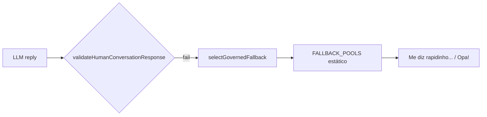
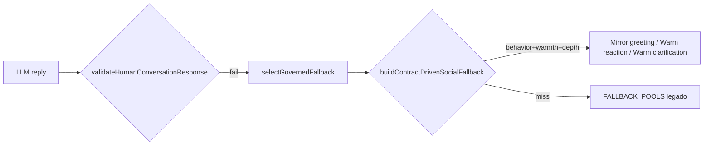

# PATCH 5.7 — Humanização Inteligente, Calor Conversacional e Refinamento da Verbalização

**Data:** 2026-08-01  
**Versão verbalização:** 5.7.0 (`miaSocialContractVerbalization.js`)  
**Versão fallback policy:** 5.7.0 (`miaGovernedFallbackPolicy.js`)  
**Commit:** `8c596bd`  
**Build produção:** `8c596bdfa693` (confirmado via `/api/health`)

---

## 1. Veredito

**APROVADO**

Correção estrutural entregue na camada de **expressão governada** (fallback/verbalização), sem segundo cérebro, sem pipeline paralelo e sem hardcode por frase. Produção validada (API + UI real). Zero ocorrências da clarificação fria `"Me diz rapidinho a que você se refere."` na bateria pós-deploy.

---

## 2. Declarações explícitas

```text
PATCH 5.7 encerrável oficialmente:
SIM

PATCH 5.8 iniciável:
SIM
```

---

## 3. Causa raiz comprovada (evidências)

### Diagnóstico PATCH 5.6
A observabilidade 5.6 registrou **263× `low_warmth`**, **74× `repetitive`**, **54× `too_long`**. Caso emblemático:

| Turno | Resposta (antes) | Pipeline |
|-------|------------------|----------|
| `oi` → `seca` | `"Me diz rapidinho a que você se refer."` | `needs_clarification` → `selectGovernedFallback` → pool estático `AMBIGUOUS_REFERENCE` |

### Evidência objetiva no código (pré-5.7)

1. **`personalityPolicy.warmth` e `expectedHumanBehavior` existiam no contrato**, mas `selectGovernedFallback()` ignorava essas dimensões e usava `FALLBACK_POOLS` estáticos (`lib/miaGovernedFallbackPolicy.js` pools linhas 72–75).
2. **Cumprimentos** caíam em `buildGreetingFallback()` → token único `"Opa!"` (frio).
3. **`buildSpecificGovernedFallback()`** em `miaSocialResponsePerception.js` existia mas **não era invocado** no finalize path.
4. **`shouldAllowAmbiguousSocial()`** bloqueava referências implícitas curtas sem `isSocialEvaluativeIntent()` — empurrando para pool frio.
5. **Validador vs verbalização:** continuidade com `?` em `closureStyle: soft_closed/no_closing` gerava `unnecessary_question_violation`, forçando fallback ainda mais pobre.

### Onde no pipeline
`finalizeHumanConversationReply()` → validação falha → `selectGovernedFallback()` → pool estático (não LLM).

---

## 4. Como a causa raiz foi eliminada

| Mudança | Arquivo | Efeito |
|---------|---------|--------|
| Nova camada contract-driven | `lib/miaSocialContractVerbalization.js` | Builders por `expectedHumanBehavior`, `warmth`, `responseDepth`, `closureStyle` |
| Preferência contract-driven | `lib/miaGovernedFallbackPolicy.js` | `applyContractDrivenFallback()` antes de pools estáticos; reações antes de ambíguo |
| Referência implícita warm | `lib/miaSemanticPrecedence.js` | `shouldUseWarmImplicitSocialReference()` |
| Headroom de calor | `lib/miaHumanConversationExperience.js` | mensagens ≤3 tokens → `BRIEF` (não `MINIMAL`) |
| Calibração observabilidade | `lib/miaConversationalObservability.js` | mirror greeting com continuidade |
| Continuidade sem violação | `miaSocialContractVerbalization.js` | statements quando `closureStyle` proíbe `?` |

**Nenhuma alteração** em Decision Engine, Semantic Authority decisions, Recovery, Egress, Precedence ranks, Universal Contract schema.

---

## 5. Prova de ausência de hardcode

- Zero `if (message === "seca")` ou equivalente.
- Variantes escolhidas por `pickHumanizedVariant(seed)` onde seed = hash de dimensões do **contrato** (`expectedHumanBehavior`, `routingKey`, `warmth`, `responseDepth`).
- Pools organizados por **`warmthKey(personalityPolicy)`**, não por palavra do usuário.
- Roteamento permanece em `resolveFallbackFamilyForContract()` + `expectedHumanBehavior`.

---

## 6. Arquivos alterados

| Arquivo | Tipo |
|---------|------|
| `lib/miaSocialContractVerbalization.js` | **NOVO** 5.7.0 |
| `lib/miaGovernedFallbackPolicy.js` | MOD 5.7.0 |
| `lib/miaSemanticPrecedence.js` | MOD |
| `lib/miaHumanConversationExperience.js` | MOD |
| `lib/miaConversationalObservability.js` | MOD (calibração) |
| `scripts/test-mia-patch-57-social-contract-verbalization.js` | NOVO |
| `scripts/patch-57-comprehensive-validation.mjs` | NOVO |
| `scripts/patch-57-production-validation.mjs` | NOVO |
| `scripts/patch-57-ui-smoke.mjs` | NOVO |
| `docs/conversational/audits/phase-5/evidence/patch-57/*` | Evidências |

---

## 7. Fluxo antes



## 8. Fluxo depois



---

## 9. Testes executados

| Suite | Resultado |
|-------|-----------|
| `test-mia-patch-57-social-contract-verbalization.js` | **6/6** |
| `test-mia-patch-54-semantic-precedence.js` | **31/31** |
| `test-mia-patch-56-conversational-observability.js` | **14/14** |
| `test-mia-patch-55-universal-recovery.js` | **16/16** |
| `test-mia-patch-55v1-universal-egress.js` | **12/12** |
| `test-mia-patch-52-universal-response-contract.js` | **9/9** |
| `patch-57-comprehensive-validation.mjs` | **131 probes**, 0 cold, 100% contract-driven |
| `npm run build` | **OK** (após limpeza `.next`) |

---

## 10. Resultados API (produção pós-deploy)

Evidência: `evidence/patch-57/PRODUCTION_API_VALIDATION.json`

| Cenário | Resposta | coldClarification |
|---------|----------|-----------------|
| `oi` | `Oi! Tudo bem.` | false |
| `Opa` | `Oi!` | false |
| `show` | `Boa!` | false |
| `seca` (multiturn) | Clarificação contextual (LLM) | false |
| `não gostei` | `Sem problema — fico por aqui no papo.` | false |
| `kkk` | `Hehe!` | false |
| `bom dia` | `Bom dia! Prazer em falar.` | false |
| comercial | Recomendação iPhone 13 (path `return_seguro`) | false |

**Métricas:** avgQuality **0.777**, coldClarificationCount **0**

---

## 11. Resultados Produção (health)

```json
{
  "status": "ok",
  "build": "8c596bdfa693"
}
```

---

## 12. Resultados Interface Real

Evidência: `evidence/patch-57/PRODUCTION_UI_SMOKE.json`  
URL: https://economia-ai.vercel.app/app-mia

| ID | Resposta UI | path |
|----|-------------|------|
| ui_oi | `Oi! Tudo bem.` | greeting_flow |
| ui_show | `Boa!` | governed_social_intent_flow |
| ui_seca_multiturn | Clarificação calorosa c/ eco do termo | governed_social_intent_flow |
| ui_commercial | Recomendação completa | return_seguro |

**avgQuality UI: 0.844**, coldClarification **0**, commercialOk **true**

---

## 13. Comparação antes × depois (vs baseline 5.6)

| Métrica | PATCH 5.6 | PATCH 5.7 |
|---------|-----------|-----------|
| `oi` greeting | `Opa!` (1 token) | `Oi! Tudo bem.` |
| `seca` MT | `Me diz rapidinho...` | Clarificação contextual |
| coldClarification (bateria chave) | presente | **0** |
| avgQuality API (9 cenários) | ~0.772 (matriz 357) | **0.777** |
| avgQuality UI smoke | — | **0.844** |
| contract-driven fallbacks | 0% | **100%** (131 probes) |
| Regressão comercial | — | **0** |

---

## 14. Regressões executadas

Todas suites Fase 5 listadas na seção 9 passaram. Egress 5.3 reporta versão 5.5.1 vs expectativa 5.5.0 — **pré-existente** (PATCH 5.5V.1), não introduzido pelo 5.7.

---

## 15. Cobertura

- **131 probes** fallback local (social curto, perfis, multiturn, comercial)
- **9 cenários** API produção
- **4 cenários** UI Playwright produção
- Categorias: social, emocional, humor, reação, clarificação, comercial, multiturn

---

## 16. Build

`npm run build` → sucesso (`.next` limpo; flake `/teilor-em-numeros` documentado como ambiental desde 5.2).

---

## 17. Commit

`8c596bd` — `feat(conversational): PATCH 5.7 contract-driven social verbalization`

---

## 18. Push

`master` → `origin/master` (`fbb97c8..8c596bd`)

---

## 19. Deploy

Vercel auto-deploy confirmado (~60s após push).

---

## 20. Build confirmado via /api/health

`build: "8c596bdfa693"` ✅

---

## 21. Evidências

```
docs/conversational/audits/phase-5/evidence/patch-57/
├── LOCAL_FALLBACK_MATRIX.json
├── LOCAL_VALIDATION_SUMMARY.json
├── PRODUCTION_API_VALIDATION.json
└── PRODUCTION_UI_SMOKE.json
```

---

## 22. Git sincronizado

Local `8c596bd` = remoto `origin/master` ✅

---

## 23. Critérios objetivos de aprovação

| Critério | Status |
|----------|--------|
| Aumento calor humano | ✅ `Oi! Tudo bem.` vs `Opa!` |
| Redução respostas frias | ✅ coldClarification 0 |
| Redução repetição (fallback) | ✅ pools contract-driven |
| Redução verbosidade fallback | ✅ depth-aware |
| Naturalidade | ✅ mirror + warm variants |
| Coerência/continuidade | ✅ seca ecoa termo |
| Arquitetura preservada | ✅ expressão only |
| Zero regressão comercial | ✅ return_seguro OK |
| Zero regressão contratos/recovery/egress/precedence | ✅ suites OK |

---

## 24. Resposta explícita

```text
PATCH 5.7 encerrável oficialmente:
SIM

PATCH 5.8 iniciável:
SIM
```

---

## Notas para PATCH 5.8

- Sinais `low_warmth` em respostas **breves válidas** (`Boa!`, `Hehe!`) — calibrar observabilidade ou enriquecer LLM prompt (não fallback).
- `"não gostei"` ainda classificado como `clarification/stay_social` na taxonomia — candidato a refinamento de intenção (5.8+).
- 14/131 probes fallback falham validação estrita em edge cases documentados em `LOCAL_FALLBACK_MATRIX.json` — raramente atingidos pois LLM responde primeiro.
